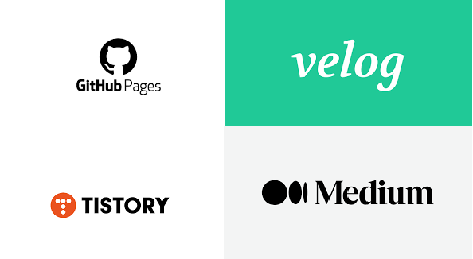

     
 
 
개발자들은 왜 기술블로그를 운영할까?
------------

개발자들이 기술 블로그를 운영하는 이유는 여러 가지가 있다. 

일반적으로 : 

  * 지식공유 : 자신이 얻은 지식과 경험을 공유.
  * 포트폴리오 구축 : 블로그를 통해 자신의 프로젝트, 코딩 스킬 등을 공개적으로 보여줌.**구인 과정에서 채용자들에게 도움이 될 수 있음.**
  * 자기 개발 : 자기개발에 도움 되는 자료를 정리하고 공유하는 데 사용. 

이 외에도 많은 이유가 있을 수 있다.

플랫폼 선정
------------

블로그를 운영하기에 앞서 우선 이용할 플랫폼을 골라야 한다.   
대표적인 블로그 플랫폼 4가지

 1. Tistory
 2. Velog
 3. Mideum
 4. GitHub Pages
---
### 1. Tistory ###

>2006년 5월 개설된 서비스형 블로그.    
>과거에는 다음, 현재는 카카오가 운영 중인 플랫폼.

### 특징

* 쉬운 운영 및 시작

* 테마와 디자인 변경 가능

* 간단한 마크다운 지원

* 네이버 연동

* 구글 애드센스 가능

### 2. Velog ###

>개발자 velopert가 1인 개발한 플랫폼.  
>개발자를 위한 블로그 서비스.

### 특징

* 개발자 생태계가 갖춰져있음

* 깔끔한 디자인

* 개발자들에게 익숙한 마크다운을 사용

* 글을 시리즈별로 작성 가능

* 광고 게재 불가능

### 3. Medium ###

>블로거와 트위터의 창시자인 어반 윌리엄스가 만든 소셜 네트워크 서비스  

### 특징

* 깔끔한 인터페이스

* SEO가 훌륭하다

* 개발자에게 친화적임

* 한글 폰트가 별로임

* 멤버쉽 제도를 이용한 수익 창출

### 4. GitHub Pages ###

>GitHub Pages는 개발자들이 손쉽게 블로그나 개인 웹사이트를 호스팅할 수 있는 무료 서비스로, 깃허브(GitHub)를 기반으로 합니다 

### 특징

* 정적 웹 사이트 호스팅

* 깃 허브와 통합

* 마크다운 지원

* Jekyll 통합 (다양한 커스텀 가능)

* 구글 애드센스 가능

 
 
 
 

요약
---
| 특징                      | 티스토리                                      | Velog                                      | 미디엄                                      | GitHub Pages                                 |
| ------------------------ | -------------------------------------------- | ------------------------------------------- | ------------------------------------------- | --------------------------------------------- |
| **마크다운 지원**          | 예 (마크다운 사용 가능)                         | 예 (마크다운 사용 가능)                         | 예 (마크다운 사용 가능)                         | 예 (마크다운 사용 가능)                           |
| **커스터마이징**            | 가능 (테마, CSS, HTML 수정 가능)                | 가능 (테마, CSS, HTML 수정 가능)                | 제한적 (일부 테마 및 커스터마이징 가능)         | 가능 (테마, CSS, HTML 수정 가능)                  |
| **무료 호스팅**            | 예 (무료 계정 제공)                            | 예 (무료 계정 제공)                            | 일부 기능은 유료 (일반적으로 무료 계정 제공)    | 예 (GitHub 계정 소유자에게 무료로 제공)           |
| **소셜 기능**              | 지원 (댓글, 공감, 공유 등)                      | 지원 (댓글, 좋아요, 리블로그 등)                | 지원 (댓글, 공감, 공유 등)                      | 제한적 (주로 소스 코드 공유를 위한 기능 지원)    |
| **프로젝트 관리**          | 일부 가능 (티스토리 프로젝트)                   | 지원 (Velog 프로젝트)                         | 없음                                        | 가능 (GitHub 저장소를 통한 프로젝트 관리 가능)   |
| **SEO 지원**               | 지원 (일부 제한적)                             | 지원 (기본적인 SEO 설정 가능)                  | 지원 (일부 제한적)                             | 지원 (페이지 내용이 검색 엔진에 노출됨)           |
| **개발자 커뮤니티**        | 없음                                           | 일부 지원 (Velog에서의 소통 가능)              | 일부 지원 (미디엄 개발자 커뮤니티)               | 지원 (GitHub의 개발자 커뮤니티와 연결)            |
| **주요 사용자층**          | 일반 사용자 및 개발자                           | 주로 개발자                                   | 다양한 분야의 저자 및 독자                    | 개발자 및 기술 블로거                             |

본인의 입맛에 맞게 블로그를 고르면 될 것 같다.

 
 
 
 

여담
---
눈치 재셨겠지만 글을 쓰고 있는 사람은 GitHub Pages로 블로그를 운영하고 있습니다.   
저 같은 경우는 GitHub와 연동할 수 있는 부분이 맘에 들어서 GitHub Pages를 선정했습니다.   

저도 블로그를 처음 시작하는 입장인 만큼 잘 부탁드리겠습니다.   

~~처음이라 그런지 조금 어렵다...~~

다음에는 GitHub Pages 블로그 만들기로 찾아뵙겠습니다.

이상.